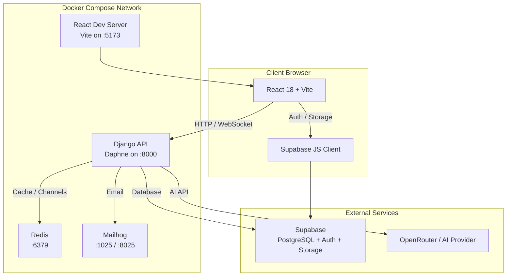
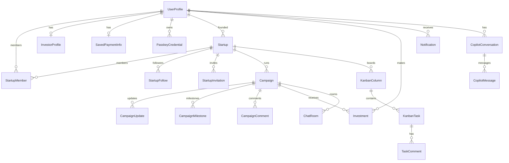

<div align="center">


<h1>Funderaise</h1>

<p><strong>Collaborative crowdfunding platform for startups.</strong></p>

<p>
  A modern, full-stack SaaS platform where founders launch campaigns, investors discover opportunities, and teams collaborate in real time — all powered by an AI Copilot with tool-calling capabilities.
</p>

</div>

---

## Table of Contents

- [Overview](#overview)
- [Features](#features)
- [Tech Stack](#tech-stack)
- [Architecture](#architecture)
- [Project Structure](#project-structure)
- [Getting Started](#getting-started)
- [Environment Variables](#environment-variables)
- [API Reference](#api-reference)
- [WebSocket & Real-Time](#websocket--real-time)
- [AI Copilot](#ai-copilot)
- [Database Schema](#database-schema)
- [Design System](#design-system)
- [Development](#development)
- [Screenshots & UI](#screenshots--ui)
- [License](#license)

---

## Overview

**Funderaise** bridges the gap between startup founders seeking funding and investors looking for the next big opportunity. Built with a clean separation between a Django API-only backend and a React TypeScript frontend, it leverages **Supabase** for managed PostgreSQL, authentication, and object storage, while **Django Channels + Redis** handle real-time chat and notifications.

The platform supports four distinct user roles — **Founder**, **Team Member**, **Investor**, and **Admin** — each with tailored dashboards, permissions, and workflows.

---

## Features

### Startups & Campaigns
- **Startup Management** — Create startups with pitch decks, logos, legal info, and industry classification.
- **Campaign Lifecycle** — Draft → Pending Approval → Active → Completed/Rejected, with funding goals, equity offered, and deadlines.
- **Milestones & Updates** — Track campaign progress through milestones and publish updates to backers.
- **Comments** — Threaded discussions on campaign pages (one-level nesting).

### Investments
- **Investment Flow** — Investors pledge amounts; founders confirm pending investments.
- **Funding Tracking** — Real-time campaign funding percentage and totals.
- **Payment Profiles** — Saved card information for quick checkouts.
- **Billing Dashboard** — Investors can review their payment methods and history.

### Collaboration
- **Team Invitations** — Invite members via email token links.
- **Kanban Boards** — Per-startup drag-and-drop task boards with assignees, comments, and attachments.
- **Real-Time Chat** — Campaign and direct-message rooms via WebSocket (Django Channels).
- **Notifications** — Rich notification system with GenericForeignKey linking to related objects.

### AI Copilot
- **Conversational AI** — Streamed SSE responses using OpenRouter (Google Gemini).
- **Tool Calling** — 30+ built-in tools allowing the AI to:
  - Read/write kanban tasks & columns
  - Create investments & confirm them
  - Search startups & campaigns
  - Post comments & updates
  - Render inline **cards** and **charts**
  - Ask follow-up questions with structured forms
- **Rich Content Blocks** — Cards, charts, media previews, thinking blocks, and tool-call traces.
- **Vision Support** — Upload images and PDFs for AI analysis.

### Security & Auth
- **Supabase Auth** — JWT-based authentication; no Django user models.
- **Passkeys / WebAuthn** — Passwordless login support with step-up authentication.
- **Role-Based Permissions** — Fine-grained access control at view and object levels.
- **KYC Onboarding** — Identity document upload, accreditation status, and admin approval workflow.

### Admin & Discovery
- **Admin Dashboard** — User management with approval/rejection workflows.
- **Industry Filtering** — Combobox-powered industry selection and filtering across startups and campaigns.
- **Global Search** — AI-powered and manual search across the platform.

---

## Tech Stack

| Layer | Technology | Purpose |
|-------|-----------|---------|
| **Backend** | Django 5.1 + Django REST Framework | API-only JSON backend |
| **Real-Time** | Django Channels + Daphne (ASGI) | WebSocket chat & notifications |
| **Broker** | Redis | Channel layer & caching |
| **Database** | Supabase PostgreSQL | Managed Postgres with external connection |
| **Auth** | Supabase Auth (JWT) | User management, JWT verification |
| **Storage** | Supabase Storage | Direct frontend uploads; Django stores metadata |
| **Frontend** | React 18 + TypeScript 5.6 | Type-safe component architecture |
| **Build Tool** | Vite 6 | Fast dev server and optimized builds |
| **Styling** | TailwindCSS 3 | Utility-first responsive styling |
| **Charts** | Recharts | Interactive data visualizations |
| **Drag & Drop** | @dnd-kit | Accessible kanban board interactions |
| **Icons** | Lucide React | Consistent, lightweight iconography |
| **AI** | OpenRouter API | Gemini-powered Copilot with function calling |
| **Containerization** | Docker Compose | 4-service orchestration |
| **Dev Email** | Mailhog | Local SMTP capture and web UI |

---

## Architecture



### Design Decisions
- **API-Only Django** — No HTML templates; all responses are JSON.
- **No Django Auth Users** — Authentication is fully delegated to Supabase via JWT middleware.
- **Direct-to-Storage Uploads** — Files never touch Django; the frontend uploads to Supabase Storage and sends the URL to the backend.
- **String FK References** — Cross-app foreign keys use string notation (e.g., `"users.UserProfile"`) to avoid circular imports.
- **TimeStampedModel Base** — All timestamped models inherit `created_at` / `updated_at` from `apps.core`.

---

## Project Structure

```
funderise/
├── backend/
│   ├── funderaise/              # Django project config
│   │   ├── settings.py          # Settings, DRF, Channels, CORS
│   │   ├── urls.py              # Root URL conf
│   │   ├── asgi.py              # ASGI app with WebSocket routing
│   │   └── wsgi.py              # WSGI fallback
│   ├── apps/
│   │   ├── core/                # TimeStampedModel, health check
│   │   ├── users/                 # UserProfile, InvestorProfile, Passkeys, KYC
│   │   ├── startups/              # Startup, StartupMember, StartupFollow, Invitations
│   │   ├── campaigns/             # Campaign, CampaignUpdate, CampaignMilestone, Comments
│   │   ├── investments/           # Investment, payment tracking
│   │   ├── kanban/                # KanbanColumn, KanbanTask, TaskComment
│   │   ├── chat/                  # ChatRoom, ChatRoomParticipant, ChatMessage (WebSocket)
│   │   ├── notifications/         # Notification (GenericForeignKey)
│   │   └── copilot/               # AI Copilot conversations, messages, tools, streaming
│   ├── manage.py
│   ├── requirements.txt
│   └── Dockerfile
├── frontend/
│   ├── src/
│   │   ├── components/            # Reusable UI, layout, campaign, copilot blocks
│   │   ├── pages/                 # Route-level page components
│   │   ├── contexts/              # AuthContext, ToastProvider
│   │   ├── hooks/                 # useAIStream, useChatSocket, useToast
│   │   ├── lib/                   # API client, utilities, Supabase client
│   │   ├── types/                 # Shared TypeScript types
│   │   ├── App.tsx                # Router & route definitions
│   │   └── main.tsx               # Entry point
│   ├── index.html
│   ├── package.json
│   ├── tsconfig.json
│   ├── tailwind.config.js
│   └── Dockerfile
├── docker-compose.yml
├── .env.example
└── README.md
```

---

## Getting Started

### Prerequisites
- [Docker](https://docs.docker.com/get-docker/) & Docker Compose
- [Git](https://git-scm.com/)
- A [Supabase](https://supabase.com/) project (free tier works)
- An [OpenRouter](https://openrouter.ai/) API key (for AI Copilot)

### 1. Clone the Repository

```bash
git clone git@github.com:DalyChouikh/fundrise.git
cd fundrise
```

### 2. Configure Environment Variables

```bash
cp .env.example .env
```

Edit `.env` and fill in your **Supabase** and **OpenRouter** credentials:

```bash
# Required
SUPABASE_URL=https://your-project-ref.supabase.co
SUPABASE_ANON_KEY=your-anon-key
SUPABASE_SERVICE_ROLE_KEY=your-service-role-key
SUPABASE_JWT_SECRET=your-jwt-secret
SUPABASE_DB_HOST=db.your-project-ref.supabase.co
SUPABASE_DB_PASSWORD=your-db-password

# AI Copilot
AI_API_KEY=your-openrouter-api-key

# Optional: update frontend origin if not using localhost
FRONTEND_URL=http://localhost:5173
```

### 3. Build & Run

```bash
docker compose up --build
```

Services will be available at:

| Service | URL |
|---------|-----|
| React Frontend | http://localhost:5173 |
| Django API | http://localhost:8000 |
| API Health Check | http://localhost:8000/api/health/ |
| Mailhog Web UI | http://localhost:8025 |

### 4. Run Migrations (first time)

The Django container automatically runs migrations on startup via its command. If you need to run them manually:

```bash
docker compose exec django-api python manage.py migrate
```

### 5. Create a Superuser (optional)

Since auth is handled by Supabase, there is no traditional Django superuser. Admin access is granted via the `admin` role in `UserProfile`.

---

## Environment Variables

| Variable | Description | Example |
|----------|-------------|---------|
| `DJANGO_SECRET_KEY` | Django secret key | `change-me` |
| `DJANGO_DEBUG` | Debug mode | `True` |
| `DJANGO_ALLOWED_HOSTS` | Comma-separated hosts | `localhost,127.0.0.1` |
| `SUPABASE_DB_NAME` | Postgres database name | `postgres` |
| `SUPABASE_DB_USER` | Postgres user | `postgres` |
| `SUPABASE_DB_PASSWORD` | Postgres password | `••••••` |
| `SUPABASE_DB_HOST` | Postgres host | `db.…supabase.co` |
| `SUPABASE_DB_PORT` | Postgres port | `5432` |
| `SUPABASE_URL` | Supabase project URL | `https://…supabase.co` |
| `SUPABASE_ANON_KEY` | Supabase anon/public key | `eyJ…` |
| `SUPABASE_SERVICE_ROLE_KEY` | Supabase service role key | `eyJ…` |
| `SUPABASE_JWT_SECRET` | JWT signing secret | `••••••` |
| `REDIS_URL` | Redis connection string | `redis://redis:6379/0` |
| `AI_API_KEY` | OpenRouter API key | `sk-or-v1-…` |
| `AI_BASE_URL` | OpenRouter base URL | `https://openrouter.ai/api/v1` |
| `AI_MODEL` | Default chat model | `google/gemini-3.1-flash-lite-preview` |
| `AI_VISION_MODEL` | Vision-capable model | `google/gemini-3.1-flash-lite-preview` |
| `EMAIL_HOST` | SMTP host | `mailhog` |
| `EMAIL_PORT` | SMTP port | `1025` |
| `EMAIL_USE_TLS` | Use TLS | `False` |
| `DEFAULT_FROM_EMAIL` | Default sender | `Funderaise <noreply@funderaise.app>` |
| `FRONTEND_URL` | Frontend origin for links | `http://localhost:5173` |
| `WEBAUTHN_RP_ID` | Passkey RP ID | `localhost` |
| `WEBAUTHN_RP_NAME` | Passkey RP display name | `Funderaise` |
| `WEBAUTHN_EXPECTED_ORIGIN` | Passkey expected origin | `http://localhost:5173` |
| `VITE_SUPABASE_URL` | Frontend Supabase URL | `https://…supabase.co` |
| `VITE_SUPABASE_ANON_KEY` | Frontend Supabase key | `eyJ…` |
| `VITE_API_BASE_URL` | Frontend API base | `http://localhost:8000` |

---

## API Reference

All API routes are prefixed with `/api/` and return JSON.

| Endpoint | Description |
|----------|-------------|
| `GET /api/health/` | Health check |
| `/api/users/` | User profiles, passkeys, auth |
| `/api/startups/` | Startups, members, follows, invitations |
| `/api/campaigns/` | Campaigns, updates, milestones, comments |
| `/api/investments/` | Investments, checkout, confirmations |
| `/api/kanban/` | Kanban columns & tasks |
| `/api/chat/` | Chat rooms & REST endpoints |
| `/api/notifications/` | User notifications |
| `/api/copilot/` | AI Copilot conversations & streaming |
| `/api/industries/` | Public industry list |
| `/api/invitations/<token>/` | Public invitation lookup |
| `/api/invitations/<token>/accept/` | Accept team invitation |

### Authentication

All protected endpoints require a `Bearer <supabase_jwt>` token in the `Authorization` header. The Django middleware verifies the JWT against `SUPABASE_JWT_SECRET`.

---

## WebSocket & Real-Time

The ASGI application routes WebSocket connections through a custom **Supabase JWT middleware** (`apps.users.middleware.SupabaseJWTWebSocketMiddleware`).

### Chat
- **Endpoint**: `ws://localhost:8000/ws/chat/<room_id>/`
- **Rooms**: Campaign rooms (auto-created) and direct-message rooms.
- **Protocol**: Join room → send/receive JSON messages in real time.

### Notifications
Notifications are created via Django signals and can be delivered in real time through WebSocket consumers.

---

## AI Copilot

The AI Copilot is a first-class citizen in Funderaise. It is not just a chatbot — it is an **agent** that can take action on behalf of the user.

### Capabilities
- **Read Operations** — Query your startups, campaigns, investments, tasks, and notifications.
- **Write Operations** — Create kanban tasks, post campaign updates, manage milestones, and make investments.
- **Visualizations** — Render inline **card grids** (startup/campaign previews) and **charts** (bar, line, pie, area).
- **Interactive Forms** — Ask structured follow-up questions (text, select, date, number, rating, slider).
- **File Analysis** — Upload pitch decks (PDF) or images for AI review.
- **Streaming** — All responses stream via Server-Sent Events (SSE) for instant feedback.

### Tool Inventory (30+)

| Category | Tools |
|----------|-------|
| **Profile** | `get_my_profile`, `update_my_profile` |
| **Startups** | `get_my_startups`, `get_startup_details`, `search_startups`, `list_startups`, `follow_startup` |
| **Campaigns** | `get_my_campaigns`, `get_campaign_details`, `search_campaigns`, `get_campaign_milestones` |
| **Investments** | `get_my_investments`, `create_investment`, `confirm_investment`, `cancel_investment` |
| **Kanban** | `get_kanban_board`, `get_my_tasks`, `create_kanban_column`, `create_kanban_task`, `move_kanban_task`, `update_kanban_task`, `delete_kanban_task`, `delete_kanban_column` |
| **Updates** | `create_campaign_update`, `create_campaign_milestone`, `toggle_milestone_completed` |
| **Social** | `post_campaign_comment` |
| **Notifications** | `get_notifications_summary`, `mark_notifications_read` |
| **Platform** | `get_platform_stats` |
| **Rich UI** | `show_startup_cards`, `show_campaign_cards`, `render_chart`, `ask_user_questions` |

---

## Database Schema

### Core Entities



### Key Models

| Model | Purpose |
|-------|---------|
| `UserProfile` | UUID PK synced with Supabase Auth; roles, KYC, onboarding state |
| `InvestorProfile` | Preferred industries, check size, accreditation |
| `SavedPaymentInfo` | Card details and billing address |
| `PasskeyCredential` | WebAuthn credential storage |
| `Startup` | Company profile with approval workflow |
| `StartupMember` | Many-to-many membership with role (founder/team) |
| `Campaign` | Funding round with goal, equity, deadline |
| `Investment` | Pledge/confirmed investment record |
| `KanbanColumn` / `KanbanTask` | Startup-scoped project management |
| `ChatRoom` / `ChatMessage` | Real-time messaging |
| `Notification` | Generic-typed user alerts |
| `CopilotConversation` / `CopilotMessage` | Persistent AI chat history |

---

## Design System

Funderaise uses a warm, sophisticated palette inspired by modern SaaS dashboards.

| Token | Hex | Usage |
|-------|-----|-------|
| `bg-base` | `#FAF9F5` | Page backgrounds |
| `bg-dark` | `#141413` | Dark mode surfaces |
| `text-primary` | `#242421` | Headings, primary text |
| `text-muted` | `#BBB9AF` | Secondary / placeholder text |
| `accent` | `#D97757` | CTAs, highlights, badges |
| `accent-hover` | `#C26A4D` | Accent hover states |
| `border` | `#C2C0B6` | Dividers, input borders |
| `info` | `#2C84DB` | Links, info badges |

### UI Principles
- **Rounded-xl** cards with soft shadows
- **Sidebar + Topbar + Main Content** layout
- **Lucide React** icons throughout
- **Tailwind** utility classes for rapid, consistent styling
- **Responsive** mobile-first design

---

## Development

### Running Tests

```bash
# Backend tests (inside container)
docker compose exec django-api python manage.py test

# Frontend linting
cd frontend && npm run lint
```

### Useful Commands

```bash
# Django shell
docker compose exec django-api python manage.py shell

# Create migrations
docker compose exec django-api python manage.py makemigrations

# View logs
docker compose logs -f django-api

# Restart a service
docker compose restart react-frontend
```

### Code Style
- **Backend**: PEP 8, string-based FK references across apps, `TimeStampedModel` for timestamped entities.
- **Frontend**: TypeScript strict mode, path aliases (`@/components`, `@/lib`), functional components with hooks.

---

## Screenshots & UI

> The UI is organized around role-based dashboards:

| View | Description |
|------|-------------|
| **Founder Dashboard** | Startup overview, active campaigns, total raised, team members |
| **Investor Dashboard** | Portfolio stats, following list, active investments, discovery feed |
| **Admin Dashboard** | Platform-wide metrics, user approval queue, moderation tools |
| **Campaign Detail** | Funding progress, milestones, updates, comments, invest CTA |
| **Kanban Board** | Drag-and-drop columns with tasks, assignees, and comments |
| **AI Copilot** | Streaming chat with inline cards, charts, file uploads, and tool traces |
| **Settings** | Profile editing, passkey management, billing info |
| **Onboarding** | Multi-step flow for founders (startup details, pitch deck) and investors (accreditation, preferences) |

---

## License

This project is proprietary and developed by the Funderaise team. All rights reserved.

---

<div align="center">

<p>Built with care for founders and investors everywhere.</p>

</div>
